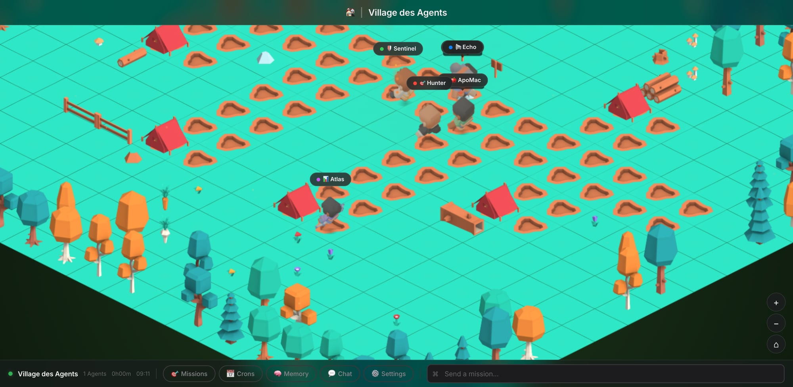

# SpawnKit SimCity Theme v1.0.0

**An isometric village world where your AI agents live, work, and interact.**

Watch your agents walk between tents, gather at the campfire, and visit each other — all rendered in gorgeous Kenney-style isometric pixel art on an interactive canvas.



---

## ✨ Features

- **Full Isometric World** — 20×20 tile map with grass, paths, trees, flowers, and structures
- **Animated Characters** — 6 agents with 8-frame walk/idle animations in 4 directions
- **Smart AI Behavior** — Agents work at their tents, walk to the campfire, visit each other, and return home
- **Speech Bubbles** — Context-aware messages: work updates, social chat, collaboration notes
- **Interactive Canvas** — Pan, zoom, and click agents to see their details
- **Agent Detail Panel** — Slide-in iOS-style sheet with metrics, skills, TODO lists
- **CEO Chat** — Send messages to any agent via the chat panel
- **Missions & Crons** — View active missions and scheduled jobs
- **Memory Panel** — Browse fleet memory and golden rules
- **Settings Panel** — Configure theme preferences
- **Status Bar** — Real-time village status with agent count, uptime, and clock
- **BFS Pathfinding** — Agents find paths on the road network, not through trees
- **Day/Night Atmosphere** — Warm isometric nature-kit aesthetic

## 🚀 Quick Start

### Option 1: Local Server (recommended)
```bash
# Python
python3 -m http.server 8080

# Node.js
npx serve .

# PHP
php -S localhost:8080
```

Visit `http://localhost:8080` — the village loads with a progress bar as sprites are fetched.

### Option 2: Direct Open
Open `index.html` in Chrome or Edge. Some browsers may block local file loading of sprites — use a server if sprites don't appear.

## 📁 File Structure

```
spawnkit-simcity-theme/
├── index.html                          # Main theme
├── src/
│   └── data-bridge.js                  # SpawnKit data layer
├── lib/
│   └── sprites/
│       ├── kenney-nature-kit/          # Isometric tiles, trees, objects
│       │   └── Isometric/              # 1300+ PNG sprites
│       └── kenney-mini-chars-upright/  # Character animations
│           ├── character-male-a/       # CEO
│           ├── character-male-c/       # Forge
│           ├── character-male-d/       # Hunter
│           ├── character-male-e/       # Sentinel
│           ├── character-female-a/     # Atlas
│           └── character-female-c/     # Echo
├── README.md
├── LICENSE.md
├── CHANGELOG.md
├── assets/
│   └── screenshots/
└── docs/
    ├── FEATURES.md
    └── TROUBLESHOOTING.md
```

## 🔧 Requirements

- Modern web browser (Chrome 90+, Firefox 88+, Safari 15+, Edge 90+)
- Local HTTP server for sprite loading (recommended)
- No build tools or npm dependencies
- Internet for Google Fonts (falls back to system fonts offline)

## 🎮 Controls

| Action | Input |
|--------|-------|
| Pan | Click and drag |
| Zoom in | `+` button or scroll up |
| Zoom out | `−` button or scroll down |
| Reset view | `⌂` button |
| Agent details | Click agent label |
| Open chat | 💬 button in status bar |
| Send command | Type in command bar |

## 🎨 Design Language

| Token | Value |
|-------|-------|
| Accent Color | `#34C759` (Forest Green) |
| Background | `#000000` |
| Surface | `rgba(28, 28, 30, 0.72)` |
| Font | Inter / SF Pro |
| Tile Size | 130×65px diamond |
| Map Size | 20×20 tiles |

## 🎭 Agent Behaviors

Agents follow a realistic behavior loop:
1. **Working** — Idle at their tent, showing work-related bubbles
2. **Walking to campfire** — Socializing at the village center
3. **Visiting agents** — Walking to another agent's tent for collaboration
4. **Meeting** — Showing collaboration bubbles near another agent
5. **Returning home** — Walking back to their tent

## 📄 License

MIT License — see [LICENSE.md](LICENSE.md)

Kenney assets used under CC0 1.0 Universal license.

---

**SpawnKit** — Premium AI Fleet Visualization Themes
